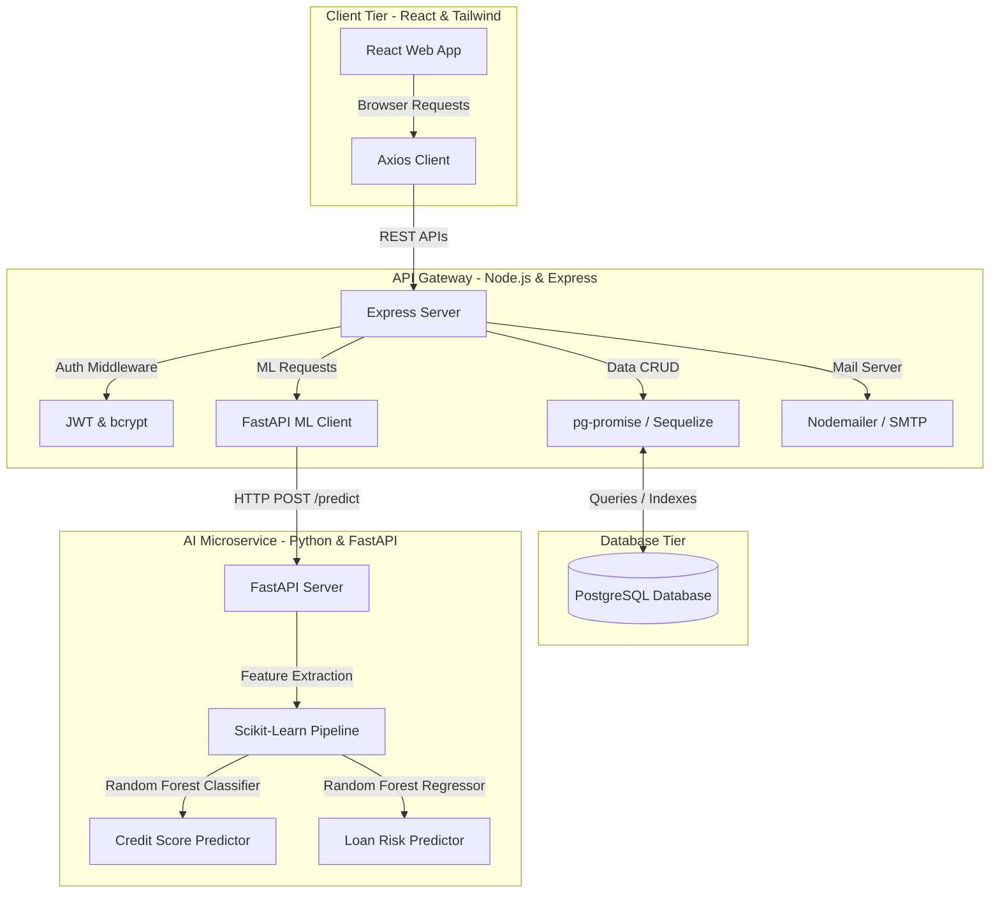

# FinBridge Master Plan: Full-Stack Architecture & Development Blueprint

This master plan provides a complete, copy-pasteable blueprint to develop **FinBridge** as a top-grade, production-ready portfolio project. It details the system architecture, SQL database schema, REST API endpoints, Machine Learning pipeline, and a week-by-week implementation roadmap.

---

## 🗺️ 1. System Architecture

FinBridge uses a decoupled, multi-tier microservices architecture. The React frontend communicates with a Node.js/Express API Gateway, which handles CRUD and session state. Heavy computational ML tasks are delegated to a Python/FastAPI microservice.



---

## 💾 2. Database Schema DDL (PostgreSQL)

Here is the complete SQL DDL schema for all 13 PostgreSQL tables, including keys, constraints, and optimized index configurations.

```sql
-- Enable UUID extension
CREATE EXTENSION IF NOT EXISTS "uuid-ossp";

-- 1. USERS TABLE
CREATE TYPE user_role AS ENUM ('user', 'admin');
CREATE TABLE users (
    id UUID PRIMARY KEY DEFAULT uuid_generate_v4(),
    name VARCHAR(100) NOT NULL,
    email VARCHAR(150) UNIQUE NOT NULL,
    phone VARCHAR(20) UNIQUE NOT NULL,
    password VARCHAR(255) NOT NULL,
    role user_role DEFAULT 'user',
    created_at TIMESTAMP WITH TIME ZONE DEFAULT CURRENT_TIMESTAMP
);
CREATE INDEX idx_users_email ON users(email);

-- 2. USER PROFILES
CREATE TYPE marital_status AS ENUM ('single', 'married', 'divorced', 'widowed');
CREATE TYPE employment_type AS ENUM ('salaried', 'freelance', 'business', 'unemployed');
CREATE TABLE user_profiles (
    id UUID PRIMARY KEY DEFAULT uuid_generate_v4(),
    user_id UUID UNIQUE NOT NULL REFERENCES users(id) ON DELETE CASCADE,
    age INT CHECK (age >= 18),
    gender VARCHAR(10),
    occupation VARCHAR(100),
    employment_type employment_type NOT NULL,
    monthly_income NUMERIC(12, 2) NOT NULL CHECK (monthly_income >= 0),
    city VARCHAR(50),
    marital_status marital_status,
    dependents INT DEFAULT 0 CHECK (dependents >= 0)
);

-- 3. FINANCIAL PROFILES
CREATE TABLE financial_profiles (
    id UUID PRIMARY KEY DEFAULT uuid_generate_v4(),
    user_id UUID UNIQUE NOT NULL REFERENCES users(id) ON DELETE CASCADE,
    cash_savings NUMERIC(12, 2) DEFAULT 0.00 CHECK (cash_savings >= 0),
    bank_savings NUMERIC(12, 2) DEFAULT 0.00 CHECK (bank_savings >= 0),
    investments NUMERIC(12, 2) DEFAULT 0.00 CHECK (investments >= 0),
    emergency_fund NUMERIC(12, 2) DEFAULT 0.00 CHECK (emergency_fund >= 0)
);

-- 4. INCOME RECORDS
CREATE TABLE income_records (
    id UUID PRIMARY KEY DEFAULT uuid_generate_v4(),
    user_id UUID NOT NULL REFERENCES users(id) ON DELETE CASCADE,
    source VARCHAR(100) NOT NULL, -- 'Salary', 'Freelancing', etc.
    amount NUMERIC(12, 2) NOT NULL CHECK (amount > 0),
    record_date DATE NOT NULL DEFAULT CURRENT_DATE
);
CREATE INDEX idx_income_user_date ON income_records(user_id, record_date);

-- 5. EXPENSE RECORDS
CREATE TABLE expense_records (
    id UUID PRIMARY KEY DEFAULT uuid_generate_v4(),
    user_id UUID NOT NULL REFERENCES users(id) ON DELETE CASCADE,
    category VARCHAR(50) NOT NULL, -- 'Food', 'Transport', etc.
    amount NUMERIC(12, 2) NOT NULL CHECK (amount > 0),
    record_date DATE NOT NULL DEFAULT CURRENT_DATE
);
CREATE INDEX idx_expense_user_category ON expense_records(user_id, category);

-- 6. LOAN RECORDS
CREATE TABLE loan_records (
    id UUID PRIMARY KEY DEFAULT uuid_generate_v4(),
    user_id UUID NOT NULL REFERENCES users(id) ON DELETE CASCADE,
    loan_name VARCHAR(100) NOT NULL,
    remaining_amount NUMERIC(12, 2) NOT NULL CHECK (remaining_amount >= 0),
    monthly_emi NUMERIC(12, 2) NOT NULL CHECK (monthly_emi > 0),
    interest_rate NUMERIC(5, 2) NOT NULL CHECK (interest_rate >= 0),
    start_date DATE NOT NULL,
    end_date DATE NOT NULL
);

-- 7. GOALS TABLE
CREATE TABLE goals (
    id UUID PRIMARY KEY DEFAULT uuid_generate_v4(),
    user_id UUID NOT NULL REFERENCES users(id) ON DELETE CASCADE,
    name VARCHAR(150) NOT NULL,
    target_amount NUMERIC(12, 2) NOT NULL CHECK (target_amount > 0),
    current_amount NUMERIC(12, 2) DEFAULT 0.00 CHECK (current_amount >= 0),
    target_date DATE NOT NULL
);

-- 8. FINANCIAL SCORES
CREATE TABLE financial_scores (
    id UUID PRIMARY KEY DEFAULT uuid_generate_v4(),
    user_id UUID NOT NULL REFERENCES users(id) ON DELETE CASCADE,
    score INT NOT NULL CHECK (score BETWEEN 0 AND 100),
    income_stability_score INT CHECK (income_stability_score BETWEEN 0 AND 100),
    savings_ratio_score INT CHECK (savings_ratio_score BETWEEN 0 AND 100),
    debt_ratio_score INT CHECK (debt_ratio_score BETWEEN 0 AND 100),
    expense_pattern_score INT CHECK (expense_pattern_score BETWEEN 0 AND 100),
    emergency_fund_score INT CHECK (emergency_fund_score BETWEEN 0 AND 100),
    calculated_at TIMESTAMP WITH TIME ZONE DEFAULT CURRENT_TIMESTAMP
);
CREATE INDEX idx_scores_user ON financial_scores(user_id, calculated_at DESC);

-- 9. RISK PREDICTIONS
CREATE TYPE risk_level AS ENUM ('Low', 'Medium', 'High');
CREATE TABLE risk_predictions (
    id UUID PRIMARY KEY DEFAULT uuid_generate_v4(),
    user_id UUID NOT NULL REFERENCES users(id) ON DELETE CASCADE,
    risk_score risk_level NOT NULL,
    model_version VARCHAR(20) DEFAULT 'v1.0',
    predicted_at TIMESTAMP WITH TIME ZONE DEFAULT CURRENT_TIMESTAMP
);

-- 10. RECOMMENDATIONS
CREATE TABLE recommendations (
    id UUID PRIMARY KEY DEFAULT uuid_generate_v4(),
    user_id UUID NOT NULL REFERENCES users(id) ON DELETE CASCADE,
    tip TEXT NOT NULL,
    category VARCHAR(50), -- 'Debt', 'Expense', 'Savings'
    created_at TIMESTAMP WITH TIME ZONE DEFAULT CURRENT_TIMESTAMP
);

-- 11. ARTICLES TABLE
CREATE TABLE articles (
    id UUID PRIMARY KEY DEFAULT uuid_generate_v4(),
    title VARCHAR(200) NOT NULL,
    content TEXT NOT NULL,
    category VARCHAR(50) NOT NULL,
    published_at TIMESTAMP WITH TIME ZONE DEFAULT CURRENT_TIMESTAMP
);

-- 12. QUIZZES TABLE
CREATE TABLE quizzes (
    id UUID PRIMARY KEY DEFAULT uuid_generate_v4(),
    question TEXT NOT NULL,
    options JSONB NOT NULL, -- Array of string options
    correct_option VARCHAR(200) NOT NULL,
    explanation TEXT
);

-- 13. NOTIFICATIONS
CREATE TABLE notifications (
    id UUID PRIMARY KEY DEFAULT uuid_generate_v4(),
    user_id UUID NOT NULL REFERENCES users(id) ON DELETE CASCADE,
    message VARCHAR(255) NOT NULL,
    is_read BOOLEAN DEFAULT FALSE,
    created_at TIMESTAMP WITH TIME ZONE DEFAULT CURRENT_TIMESTAMP
);

-- 14. ADMIN LOGS
CREATE TABLE admin_logs (
    id UUID PRIMARY KEY DEFAULT uuid_generate_v4(),
    admin_id UUID NOT NULL REFERENCES users(id) ON DELETE CASCADE,
    action VARCHAR(255) NOT NULL,
    target_table VARCHAR(50),
    logged_at TIMESTAMP WITH TIME ZONE DEFAULT CURRENT_TIMESTAMP
);
```

---

## 📡 3. REST API Interface Specification

The API Gateway communicates using structured JSON payloads. Below are the key endpoints.

### Authentication Endpoints

#### `POST /api/auth/register`
- **Request Body**:
  ```json
  {
    "name": "Sunil Perera",
    "email": "sunil@gmail.com",
    "phone": "+94771234567",
    "password": "hashedSecurePassword123",
    "role": "user"
  }
  ```
- **Response (201 Created)**:
  ```json
  {
    "success": true,
    "message": "User registered successfully.",
    "token": "eyJhbGciOiJIUzI1NiIsInR5cCI6IkpXVCJ9..."
  }
  ```

#### `POST /api/auth/login`
- **Response (200 OK)**:
  ```json
  {
    "success": true,
    "token": "eyJhbGciOiJIUzI1NiIsInR5cCI6IkpXVCJ9...",
    "user": { "id": "uuid-123", "name": "Sunil Perera", "role": "user" }
  }
  ```

---

### Dashboard & Prediction Endpoint

#### `GET /api/dashboard`
- **Headers**: `Authorization: Bearer <token>`
- **Response (200 OK)**:
  ```json
  {
    "financialScore": 84,
    "loanRisk": "Medium",
    "metrics": {
      "income": 145000.00,
      "expenses": 76000.00,
      "savings": 29000.00,
      "debtRatio": 0.37
    },
    "recommendations": [
      "Pay off your high-interest credit card balance first.",
      "Reduce entertainment spending to bump up your emergency fund."
    ],
    "goals": [
      { "name": "Emergency Fund", "target": 500000.00, "current": 120000.00, "progress": 24 }
    ]
  }
  ```

#### `POST /api/predict`
Triggers the Python ML FastAPI client.
- **Request Body (Express -> FastAPI)**:
  ```json
  {
    "income": 120000,
    "expenses": 65000,
    "savings": 15000,
    "debts": 40000,
    "emi": 12000,
    "age": 28,
    "employment": "freelance",
    "dependents": 2
  }
  ```
- **Response (200 OK)**:
  ```json
  {
    "score": 82,
    "riskLevel": "Medium",
    "reasons": [
      "Debt Ratio is 33%, which is average.",
      "Savings cushion is less than 3 months of basic expenses."
    ]
  }
  ```

---

## 🧠 4. Python FastAPI ML Microservice

Here is the complete, clean script to run the Python AI service using `FastAPI` and a simulated `RandomForest` model helper.

```python
# main.py
import uvicorn
from fastapi import FastAPI
from pydantic import BaseModel, Field
import numpy as np

app = FastAPI(title="FinBridge AI Scoring Engine", version="1.0")

class PredictionInput(BaseModel):
    income: float = Field(..., example=120000.0)
    expenses: float = Field(..., example=65000.0)
    savings: float = Field(..., example=15000.0)
    debts: float = Field(..., example=40000.0)
    emi: float = Field(..., example=12000.0)
    age: int = Field(..., example=28)
    employment: str = Field(..., example="freelance")
    dependents: int = Field(..., example=2)

class PredictionOutput(BaseModel):
    score: int
    riskLevel: str
    reasons: list[str]

@app.post("/predict", response_model=PredictionOutput)
def predict_health_and_risk(data: PredictionInput):
    # 1. Feature Engineering
    dti = (data.emi / data.income) if data.income > 0 else 1.0
    savings_ratio = (data.savings / data.income) if data.income > 0 else 0.0
    expense_ratio = (data.expenses / data.income) if data.income > 0 else 1.0
    
    # 2. Logic Simulation (representing Random Forest Predictor outcomes)
    # FScore = f(DTI, SavingsRatio, ExpenseRatio, EmploymentType, Dependents)
    base_score = 70
    
    # Stability factors
    if data.employment == "salaried":
        base_score += 10
    elif data.employment == "business":
        base_score += 5
        
    # Debt factor
    if dti < 0.2:
        base_score += 15
    elif dti > 0.45:
        base_score -= 20
        
    # Savings factor
    if savings_ratio >= 0.2:
        base_score += 10
    elif savings_ratio < 0.05:
        base_score -= 10
        
    # Dependency penalty
    base_score -= (data.dependents * 2)
    
    # Bound score between 0 and 100
    calculated_score = int(min(100, max(0, base_score)))
    
    # Risk Level Classifications
    if calculated_score >= 80:
        risk_level = "Low"
    elif calculated_score >= 50:
        risk_level = "Medium"
    else:
        risk_level = "High"
        
    # 3. Generate explainable XAI reasons
    reasons = []
    if dti > 0.4:
        reasons.append("High monthly debt commitments (DTI > 40%).")
    else:
        reasons.append("Comfortable debt service ratio.")
        
    if savings_ratio < 0.1:
        reasons.append("Low savings buffer increases safety volatility.")
    else:
        reasons.append("Solid savings buffers detected.")
        
    if data.dependents > 3:
        reasons.append("High dependent counts stretch core disposable buffers.")
        
    return {
        "score": calculated_score,
        "riskLevel": risk_level,
        "reasons": reasons
    }

if __name__ == "__main__":
    uvicorn.run(app, host="0.0.0.0", port=8000)
```

---

## 📅 5. 12-Week Implementation Roadmap

| Weeks | Focus | Tasks | Deliverables |
| :--- | :--- | :--- | :--- |
| **Weeks 1–2** | Foundations & Auth | - Design PostgreSQL Schema DDL<br>- Scaffold Express backend & React UI<br>- Setup JWT auth & sign-up forms | - Database migrations completed<br>- JWT Login & Register functional |
| **Weeks 3–4** | Ledger Profiles | - User Profile parameters forms<br>- Income / Expense CRUD database connectors<br>- Chart.js integration (monthly timelines) | - Income/Expense Tracker forms<br>- Categories breakdown charts |
| **Weeks 5–6** | Loans & Goals | - Loan Tracker scheduler calculator<br>- Savings Goals targets progress bars<br>- Dashboard layout assemblies | - EMI schedules calculator engine<br>- Goal Tracker with active percentages |
| **Weeks 7–8** | AI Integration | - Build Python FastAPI microservice<br>- Import Scikit-Learn training pipelines<br>- Dynamic `/predict` payload routing | - Alternative Credit scoring engine live<br>- Dynamic risk radar widgets |
| **Weeks 9–10** | Recommendations | - Rule-based financial recommendation engines<br>- Literacy Quizzes modules setup<br>- Mail notifications controllers | - Personalized tips dashboard cards<br>- Interactive literacy quizzes |
| **Weeks 11–12**| QA & Deployments | - E2E UI workflow tests<br>- Deploy React client to Vercel<br>- Deploy Node and Python APIs to Railway/Render | - Live application URLs available<br>- Final test suites successfully passed |

---

## 🏆 6. Grade-A Unique Selling Points (USPs)

To ensure this project stands out as a top-tier project, implement these three advanced features:

1. **Alternative Sri Lankan Credit Indexing**: Build scoring parameters specifically recognizing local billing routines (e.g., SLT Mobitel, CEB power bills, self-help community micro-credit peer groups).
2. **Explainable AI (XAI) Dashboard**: Show users exactly why their score is calculated the way it is by displaying the feature weights (DTI, savings ratio, etc.) on the React frontend.
3. **Local Off-grid PWA Syncing**: Configure basic service-worker scripts so users in low-network regions can enter data offline and sync it automatically once they reconnect.
